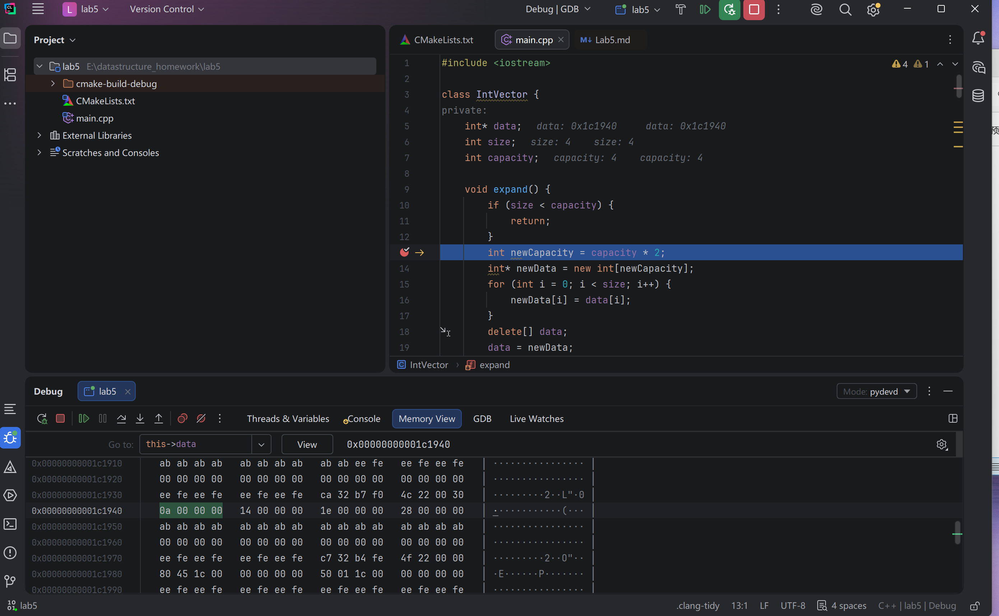
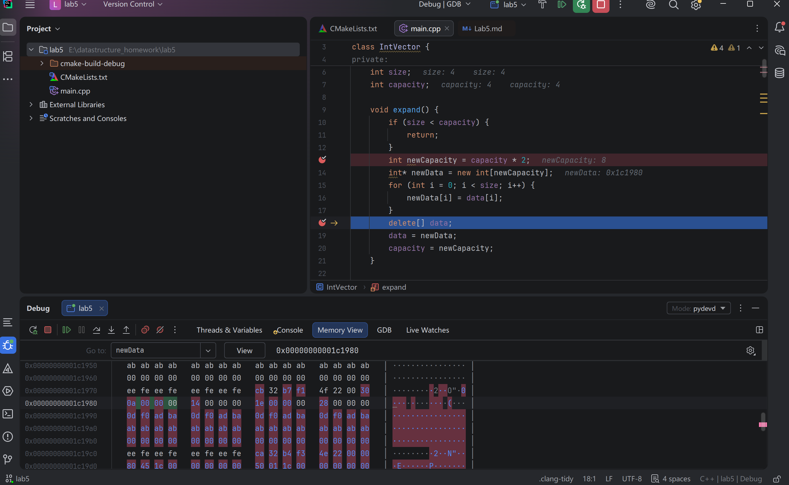
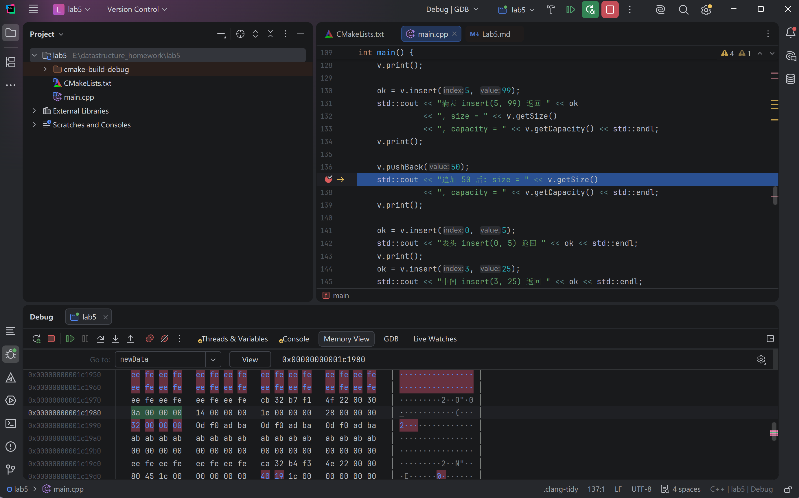

# Lab5：从固定容量类到 C++ 动态扩容向量

> **作业目标**：在 Lab4 的 `IntVector` 类基础上，把固定数组改为动态数组；区分 `size` 与 `capacity`；使用构造函数申请空间、析构函数释放空间；实现容量不足时扩大为原来两倍的 `expand()`，让原有接口继续工作；使用 CLion Memory View 截图验证扩容前后地址、数据和容量的关系。
>
> 本说明给出了新增语法、接口约定、类框架和统一测试。已经实现的成员函数可以从 Lab4 迁移。本次仍使用单个 `.cpp` 文件，所有成员函数体写在类内；不要求模板、头文件拆分、自动缩容或完整的对象复制机制。
>
> **检查说明**：程序和书面题沿用前两次作业的完成度检查口径，内容正确性将在期末统一检测；本次新增三张必交截图，图片审核会检查是否展示真实的 CLion Memory View，以及指定时刻的变量、地址和内存数据是否对应。只有代码、运行输出或变量窗口的截图不能代替 Memory View。空文件、未作答模板、占位程序和缺失截图不属于完成；自动审核规则以课程仓库发布的 Lab5 配置为准。

---

## 一、配置 CMakeLists.txt

保留 Lab4，在新的 `Lab5` 目录中完成本次作业。可复制自己的 `intvector.cpp` 作为改造起点，不要覆盖已经提交的 Lab4。

在 CLion 中创建或打开本次项目，将 `CMakeLists.txt` 改为：

```cmake
cmake_minimum_required(VERSION 3.20)
project(Lab5 C CXX)

set(CMAKE_C_STANDARD 11)
set(CMAKE_CXX_STANDARD 17)

add_executable(lab5_cpp intvector.cpp)
```

要求：

- 有且只有一个 `add_executable`，目标名为 `lab5_cpp`，源文件为 `intvector.cpp`。
- `project(...)` 与前两次作业一致，同时声明 `C` 和 `CXX`。
- 保存后重新加载 CMake 项目，运行目标选择 `lab5_cpp`。
- 本次仍然需要提交 `CMakeLists.txt`。

---

## 二、完成本次作业所需的新知识

### 2.1 固定数组改为指针成员

Lab4 中的：

```cpp
int data[MAX_SIZE];
int size;
```

改为：

```cpp
int* data;
int size;
int capacity;
```

`data` 保存当前动态数组首元素的地址，`size` 记录有效元素个数，`capacity` 记录当前数组容量。

声明 `int* data` 只得到一个指针，没有申请整数数组。必须先申请空间，才能使用 `data[i]`。

### 2.2 `new[]` 与 `delete[]` 成对使用

```cpp
int* p = new int[4];  // 申请能放四个 int 的数组
p[0] = 10;
std::cout << p[0] << std::endl;
delete[] p;          // 释放整个数组
```

- `new int[4]` 返回首元素地址；下标访问方式仍是 `p[i]`。
- `new int[4]` 不会把所有整数自动清零，读取前必须先写入。
- `new[]` 对应 `delete[]`，不能写成 `delete p`，也不能用 `free(p)`。
- 释放后不能继续访问旧地址；仅把指针设为 `nullptr` 不会释放原数组。
- `sizeof(data)` 在本次得到的是指针大小，不能用来求动态数组容量。

本次统一约定 `capacity >= 1`、`0 <= size <= capacity`，并且只读写已经作为有效元素存入的数据；插入时先获得空位，再写入新元素。

### 2.3 构造函数、默认参数与析构函数

构造函数的接口改为：

```cpp
explicit IntVector(int initialCapacity = 4);
```

本次函数体仍写在类内，以上只展示接口。它需要先把小于 `1` 的 `initialCapacity` 调整为 `1`，再申请对应容量的数组，设置 `size = 0` 和 `capacity = initialCapacity`。

| 创建方式 | 初始 `size` | 初始 `capacity` |
| :--- | :---: | :---: |
| `IntVector v;` | 0 | 4 |
| `IntVector v(2);` | 0 | 2 |
| `IntVector v(0);` | 0 | 1 |
| `IntVector v(-3);` | 0 | 1 |

`= 4` 表示不传参数时使用 `4`。`explicit` 防止整数被隐式转换成向量对象，保留即可，本次不考查转换规则。

析构函数写作 `~IntVector()`，没有返回类型、没有参数。对于本次的局部对象，离开对象所在的作用域时它自动执行，函数体负责 `delete[] data;`。`main` 不手动调用构造函数或析构函数。

指针变量消失不会自动释放它指向的数组，所以本类需要自己完成释放。析构时释放的是最后正在使用的数组；扩容前的旧数组由 `expand()` 释放。

### 2.4 扩容是申请新数组并复制

本次采用两倍扩容：`4 → 8 → 16 → 32 → …`。

`expand()` 的顺序为：

1. 若 `size < capacity`，还有空位，立即返回。
2. 计算 `newCapacity = capacity * 2`。
3. 用临时指针 `newData` 接收 `new int[newCapacity]`。
4. 将下标 `0` 到 `size - 1` 的有效元素逐个复制到新数组的相同下标。
5. 释放旧数组。
6. 让 `data` 指向新数组，再更新 `capacity`，保持 `size` 不变。

不能先释放旧数组再复制，也不能一开始就用新地址覆盖唯一的旧地址。仅修改 `capacity` 不会改变实际空间。

`data = newData` 复制的是地址。此后新数组由对象继续使用，不能在 `expand()` 末尾再执行 `delete[] newData`。

### 2.5 插入与删除的约定

- 插入位置必须满足 `0 <= index <= size`。先检查位置，非法就返回 `false`；合法才调用 `expand()`，随后按 Lab4 的方向右移、写入新值、增加 `size`。
- 满表不再是插入失败的理由；有合法位置时应扩容后继续插入。
- 非法操作不得改变元素、`size`、`capacity` 或引用输出参数；尤其不能先扩容再检查非法下标。
- 读取和删除仍要求 `0 <= index < size`，不能把检查范围改成 `capacity`。
- 删除只移动元素并减少 `size`，本次不缩容，不释放整个数组。删除全部元素后可以继续利用原空间插入。

### 2.6 追加复用插入，查询保持原约定

`pushBack(value)` 的含义是在末尾追加，相当于 `insert(size, value)`。本次要求它直接调用 `insert`，不要再写一套扩容代码，也不要在两处都增加 `size`。

`get` 成功时把元素写入引用参数，失败保持引用参数不变；`find` 返回第一次出现的下标，未找到返回 `-1`。两者的含义与 Lab4 相同。

查询函数继续保留末尾的 `const`，并在实现中遵守只读约定。把数组换成指针不会自动检查下标，也不会自动保证元素不被错误修改。

### 2.7 暂时禁止复制对象

框架提供以下两行，必须原样保留：

```cpp
IntVector(const IntVector&) = delete;
IntVector& operator=(const IntVector&) = delete;
```

只需理解“禁止复制”，不要求解释其完整语法。不要写 `IntVector b = a;`、`b = a;`，不要把对象按值传给函数。

直接复制指针可能让两个对象共用同一块数组，进而出现失效地址或重复释放。分别创建两个对象，例如 `IntVector a; IntVector b;`，仍然允许，每个对象会申请自己的数组。

> 本次只测试小规模数据，假定动态内存申请成功，容量翻倍不超出 `int` 范围。不要求捕获内存申请失败的异常。接口中的 `false` 表示下标非法，不代表程序已经处理了所有资源不足的情况。

---

## 三、intvector.cpp：完成动态整数向量

### 3.1 本次改造清单

| 部分 | 本次要求 |
| :--- | :--- |
| 数据成员 | 去掉 `MAX_SIZE` 和固定数组，使用私有的 `data`、`size`、`capacity` |
| 构造函数 | 改为接收初始容量，申请动态数组，建立空表 |
| 析构函数 | 新增，释放当前数组 |
| `expand()` | 新增私有成员函数，空间不足时按两倍扩容 |
| `getCapacity()` | 新增，返回当前容量 |
| `insert()` | 保留位置约定与移动方向，满表时扩容后继续插入 |
| `pushBack()` | 新增，通过 `insert(size, value)` 追加 |
| `getSize()`、`empty()` | 框架已给出正确实现，保留即可 |
| `get()`、`find()`、`remove()`、`print()` | 迁移 Lab4 的正确实现，继续只处理有效元素 |

### 3.2 必须使用的类框架

不得修改类名、三个数据成员、成员函数名称、参数、返回类型或末尾的 `const`，不得增加数据成员；函数体写在类内。

下面的框架加上 3.4 的 `main` 可以编译运行，但只产生占位结果。构造函数中的 `nullptr`、零容量用于让未完成的框架保持可运行；完成作业时必须替换为符合要求的初始化，不能保留这个占位状态。

```cpp
#include <iostream>

class IntVector {
private:
    int* data;
    int size;
    int capacity;

    // 有空位就直接返回；否则申请两倍容量，复制、释放、更新
    // 只改变空间，不改变 size 和已有元素的顺序
    void expand() {
        // TODO：按 2.4 的步骤实现
    }

public:
    explicit IntVector(int initialCapacity = 4) {
        data = nullptr;
        size = 0;
        capacity = 0;
        // TODO：把本函数体替换为正确的构造过程
        // 小于 1 的初始容量统一调整为 1
    }

    ~IntVector() {
        // TODO：释放当前动态数组
    }

    // 教师提供：禁止复制对象，原样保留，不考查完整语法
    IntVector(const IntVector&) = delete;
    IntVector& operator=(const IntVector&) = delete;

    int getSize() const {
        return size;
    }

    int getCapacity() const {
        return 0;  // TODO
    }

    bool empty() const {
        return size == 0;
    }

    // 成功返回 true 并写入 value；非法下标返回 false，保持 value 不变
    bool get(int index, int& value) const {
        return false;  // TODO：迁移 Lab4
    }

    // 返回第一次出现的下标，未找到返回 -1
    int find(int value) const {
        return -1;  // TODO：迁移 Lab4
    }

    // 先检查 0 <= index <= size，再 expand，再按 Lab4 的方向右移
    // 成功返回 true；非法下标返回 false，整个对象状态不变
    bool insert(int index, int value) {
        return false;  // TODO：改造 Lab4
    }

    // 成功返回 true 并写入 removed；非法下标返回 false，保持 removed 不变
    // 本次不缩容，不在这里 delete[] data
    bool remove(int index, int& removed) {
        return false;  // TODO：迁移 Lab4
    }

    void pushBack(int value) {
        // TODO：调用 insert(size, value)
    }

    // 元素之间一个空格，行首、行尾没有空格，最后换行；空表只输出换行
    void print() const {
        std::cout << std::endl;  // TODO：迁移 Lab4，补上有效元素输出
    }
};
```

### 3.3 实现要求

1. `data`、`size`、`capacity` 和 `expand()` 必须在 `private:` 下，其他接口与禁用复制声明在 `public:` 下。类外通过成员函数使用对象。
2. 所有 `TODO` 必须替换为真实实现。构造后必须满足 `capacity >= 1`、`size == 0`，且 `data` 指向容量与记录一致的数组。
3. `expand()` 只在已满时申请新数组，只复制有效元素；必须先复制、再释放旧数组，最后更新指针和容量，不修改 `size`。本次统一使用局部变量名 `newCapacity` 和 `newData`，便于按固定步骤观察。
4. `insert()` 必须先检查下标，再调用 `expand()`；随后从后向前移动元素，写入新值，最后让 `size` 加一。不能保留 Lab4 中“表满就返回 `false`”的分支。
5. `remove()` 必须先检查下标，再保存被删值，从前向后移动元素，最后让 `size` 减一；失败时不得修改引用参数。
6. `get()`、`find()` 和 `print()` 只处理有效区间，不能读取备用位置。`get()` 失败时保持输出参数不变。
7. `pushBack()` 必须复用 `insert(size, value)`。不得在 `pushBack()` 和 `insert()` 中重复增加 `size`。
8. 本次不自动缩容。删除全部元素后，容量保持不变；对象离开作用域时由析构函数释放最后一块数组。
9. 只能包含 `<iostream>`，输出使用 `std::cout`；不得使用 `printf`、`std::vector`、`malloc/free/realloc`、全局变量或额外的固定大数组代替扩容。
10. 数组申请使用 `new[]`，释放使用 `delete[]`；保留两行禁用复制声明。不得通过硬编码测试结果或修改统一 `main` 代替实现。

### 3.4 统一 main 函数

把下面代码**原样**放在类定义后。测试包括：空表操作、容量充足时追加、满表上的非法插入、两次扩容、表头/中间/表尾插入与删除、越界操作、删除全部后继续追加，以及不同初始容量和重复值。

```cpp
int main() {
    IntVector v;
    std::cout << "空表: size = " << v.getSize()
              << ", capacity = " << v.getCapacity()
              << ", empty = " << v.empty() << std::endl;

    int value = 777;
    bool ok = v.get(0, value);
    std::cout << "空表 get(0) 返回 " << ok << ", value = " << value << std::endl;
    int removed = 888;
    ok = v.remove(0, removed);
    std::cout << "空表 remove(0) 返回 " << ok << ", removed = " << removed << std::endl;

    v.pushBack(10);
    v.pushBack(20);
    v.pushBack(30);
    v.pushBack(40);
    std::cout << "首次装满: size = " << v.getSize()
              << ", capacity = " << v.getCapacity() << std::endl;
    v.print();

    ok = v.insert(5, 99);
    std::cout << "满表 insert(5, 99) 返回 " << ok
              << ", size = " << v.getSize()
              << ", capacity = " << v.getCapacity() << std::endl;
    v.print();

    v.pushBack(50);
    std::cout << "追加 50 后: size = " << v.getSize()
              << ", capacity = " << v.getCapacity() << std::endl;
    v.print();

    ok = v.insert(0, 5);
    std::cout << "表头 insert(0, 5) 返回 " << ok << std::endl;
    v.print();
    ok = v.insert(3, 25);
    std::cout << "中间 insert(3, 25) 返回 " << ok << std::endl;
    v.print();
    ok = v.insert(v.getSize(), 60);
    std::cout << "表尾插入 60 返回 " << ok << std::endl;
    v.print();
    std::cout << "再次装满: size = " << v.getSize()
              << ", capacity = " << v.getCapacity() << std::endl;

    ok = v.insert(4, 28);
    std::cout << "满表 insert(4, 28) 返回 " << ok
              << ", size = " << v.getSize()
              << ", capacity = " << v.getCapacity() << std::endl;
    v.print();

    ok = v.remove(0, removed);
    std::cout << "remove(0) 返回 " << ok << ", removed = " << removed << std::endl;
    v.print();
    ok = v.remove(3, removed);
    std::cout << "remove(3) 返回 " << ok << ", removed = " << removed << std::endl;
    v.print();
    ok = v.remove(v.getSize() - 1, removed);
    std::cout << "删除表尾 返回 " << ok << ", removed = " << removed << std::endl;
    v.print();
    std::cout << "删除后: size = " << v.getSize()
              << ", capacity = " << v.getCapacity() << std::endl;

    ok = v.get(3, value);
    std::cout << "get(3) 返回 " << ok << ", value = " << value << std::endl;
    std::cout << "find(30) = " << v.find(30) << std::endl;
    std::cout << "find(99) = " << v.find(99) << std::endl;

    value = 777;
    ok = v.get(v.getSize(), value);
    std::cout << "get(size) 返回 " << ok << ", value = " << value << std::endl;
    ok = v.get(-1, value);
    std::cout << "get(-1) 返回 " << ok << ", value = " << value << std::endl;
    removed = 888;
    ok = v.remove(v.getSize(), removed);
    std::cout << "remove(size) 返回 " << ok << ", removed = " << removed << std::endl;
    ok = v.remove(-1, removed);
    std::cout << "remove(-1) 返回 " << ok << ", removed = " << removed << std::endl;
    ok = v.insert(-1, 99);
    std::cout << "insert(-1, 99) 返回 " << ok << std::endl;
    std::cout << "非法操作后: size = " << v.getSize()
              << ", capacity = " << v.getCapacity() << std::endl;
    v.print();

    for (int i = 0; i < 6; i++) {
        v.remove(0, removed);
    }
    std::cout << "删除全部: size = " << v.getSize()
              << ", capacity = " << v.getCapacity()
              << ", empty = " << v.empty() << std::endl;
    v.pushBack(-1);
    std::cout << "清空后追加: size = " << v.getSize()
              << ", capacity = " << v.getCapacity() << std::endl;
    v.print();

    IntVector small(0);
    std::cout << "初始容量传 0: size = " << small.getSize()
              << ", capacity = " << small.getCapacity() << std::endl;
    small.pushBack(7);
    small.pushBack(7);
    std::cout << "small: size = " << small.getSize()
              << ", capacity = " << small.getCapacity() << std::endl;
    small.print();
    std::cout << "small.find(7) = " << small.find(7) << std::endl;

    IntVector negative(-3);
    std::cout << "初始容量传 -3: size = " << negative.getSize()
              << ", capacity = " << negative.getCapacity() << std::endl;
    std::cout << "v 仍为: ";
    v.print();
    std::cout << "各对象的 size: " << v.getSize()
              << ' ' << small.getSize()
              << ' ' << negative.getSize() << std::endl;

    return 0;
}
```

### 3.5 期望输出与核对重点

程序输出应与下面完全一致。`bool` 按默认方式输出为 `1` 或 `0`；不要启用 `std::boolalpha`，也不要在构造、析构或扩容函数中保留额外的调试输出。

```text
空表: size = 0, capacity = 4, empty = 1
空表 get(0) 返回 0, value = 777
空表 remove(0) 返回 0, removed = 888
首次装满: size = 4, capacity = 4
10 20 30 40
满表 insert(5, 99) 返回 0, size = 4, capacity = 4
10 20 30 40
追加 50 后: size = 5, capacity = 8
10 20 30 40 50
表头 insert(0, 5) 返回 1
5 10 20 30 40 50
中间 insert(3, 25) 返回 1
5 10 20 25 30 40 50
表尾插入 60 返回 1
5 10 20 25 30 40 50 60
再次装满: size = 8, capacity = 8
满表 insert(4, 28) 返回 1, size = 9, capacity = 16
5 10 20 25 28 30 40 50 60
remove(0) 返回 1, removed = 5
10 20 25 28 30 40 50 60
remove(3) 返回 1, removed = 28
10 20 25 30 40 50 60
删除表尾 返回 1, removed = 60
10 20 25 30 40 50
删除后: size = 6, capacity = 16
get(3) 返回 1, value = 30
find(30) = 3
find(99) = -1
get(size) 返回 0, value = 777
get(-1) 返回 0, value = 777
remove(size) 返回 0, removed = 888
remove(-1) 返回 0, removed = 888
insert(-1, 99) 返回 0
非法操作后: size = 6, capacity = 16
10 20 25 30 40 50
删除全部: size = 0, capacity = 16, empty = 1
清空后追加: size = 1, capacity = 16
-1
初始容量传 0: size = 0, capacity = 1
small: size = 2, capacity = 2
7 7
small.find(7) = 0
初始容量传 -3: size = 0, capacity = 1
v 仍为: -1
各对象的 size: 1 2 0
```

核对时重点观察：

- `v` 追加 `50` 时容量由 `4` 变成 `8`；在满表中间插入 `28` 时由 `8` 变成 `16`。两次扩容都保留已有元素。
- 满表上的 `insert(5, 99)` 失败后，容量仍为 `4`。
- 插入位置可以等于 `size`；读取和删除的位置不能等于 `size`。
- 所有失败的读取和删除都保持预设的 `777`、`888` 不变。这两个数是测试用初值，不是接口规定的失败标记。
- 删除全部元素后，容量仍为 `16`，下一次追加无需扩容。
- `small` 初始容量调整为 `1`，第二次追加时扩为 `2`；重复值查找返回第一次出现的位置。
- `v`、`small` 和 `negative` 是分别构造的对象，各自维护数据与容量。

程序必须能够使用 C++17 独立编译运行；输出应由真实操作、函数返回值和当前状态生成，不得把上述结果写死在输出语句中。

### 3.6 必做：CLion Memory View 截图验证

本项按下面的固定步骤完成，检查你能否把扩容过程与实际内存对应起来，不考查调试快捷键或复杂的窗口操作。先完成程序，再调试统一 `main`，不为截图改写程序逻辑。完成截图后，必须把 3.6.4 的观察记录填写完整。

操作入口参考：[CLion 官方文档：Memory view](https://www.jetbrains.com/help/clion/memory-view.html)。

#### 3.6.1 准备调试

1. 在 CLion 的 CMake 配置中选择 **Debug**，运行目标选择 `lab5_cpp`。重新构建后使用 **Debug** 启动程序。
2. 先在 `expand()` 中的 `int newCapacity = capacity * 2;` 行左侧设置断点。该行在“空间充足就返回”的判断之后，正确程序第一次到达这里，应当是在 `v.pushBack(50);` 引起的扩容中。
3. 程序暂停后，在 Debug 窗口选中 `expand()` 栈帧，在 **Variables** 中展开 `this`，显示 `data`、`size` 和 `capacity`。
4. 右键 `data`，选择 **Show in Memory View**。应当看到地址、十六进制字节和右侧的字符对照栏。需要跳转时，在视图的 **Go to** 中输入当前作用域内的指针表达式。
5. 用 **Step Over** 越过语句，避免进入 `new[]` 等库函数内部。暂停在某行上，通常表示这一行尚未执行；下面要求“停在释放之前”，就是停在 `delete[] data;` 行上，尚未越过它。

如果 Variables 与 Memory View 是互斥标签页，可在 Variables/Watches 工具栏使用“在编辑器中打开内存视图”的按钮（官方文档中的 **Open memory view in the editor**），把生成的内存标签拖到编辑区一侧形成分栏，保留另一侧的源代码，再将 Debug 窗口切回 Variables。只要同一张图能看清代码、关键变量和内存即可；调试器内联变量面板同样可以用来显示关键值。

如果第一次扩容发生在非法的 `insert(5, 99)` 中，先修正“检查下标与扩容”的顺序。这里应当验证追加 `50` 的首次合法扩容。

要查看的是 `data` 指向的数组，不是 `&data` 所指的指针变量本身。调试器中可以展开私有成员进行观察，这不要求、也不允许把源代码中的成员改为 `public`。

#### 3.6.2 三张截图的固定位置

三张图必须来自**同一次 Debug 运行**，依次完成。若重新启动了程序，地址可能改变，应重新完成整组三张截图。

**A．扩容前：`imgs/memory_before.png`**

暂停在 `int newCapacity = capacity * 2;`，通过 `data` 打开 Memory View。截图应清楚显示：

- 当前代码位置在 `expand()` 的容量计算处，新数组尚未申请。
- `size == 4`、`capacity == 4`，以及 `data` 的旧数组地址。
- 内存视图中，从该地址开始的四个整数对应 `10、20、30、40`。

此时 `newData` 还没有完成初始化，不要求显示或解释它的值。

将截图放入指定目录后，下面应能正常显示图片：



**B．复制完成、尚未释放：`imgs/memory_copied.png`**

在 `expand()` 的 `delete[] data;` 行设置第二个断点，继续运行到此处，先不要执行这一行。通过局部指针 **`newData`** 打开 Memory View。截图应清楚显示：

- 当前代码位置在复制循环之后、释放旧数组之前。
- 对象仍为 `size == 4`、`capacity == 4`，局部变量 `newCapacity == 8`。
- `data` 与 `newData` 的地址不同；`data` 与图 A 中的地址一致。
- 新数组前四个整数已经复制为 `10、20、30、40`。

只要求内存视图显示 `newData` 对应的区域，变量区同时显示两个指针即可，不要求在一张图里并排打开两个内存窗口。`newData` 后面尚未使用的位置不要求为零。

将截图放入指定目录后，下面应能正常显示图片：



**C．扩容并追加完成：`imgs/memory_after.png`**

在 `main` 中，紧接 `v.pushBack(50);` 的 `std::cout << "追加 50 后: size = " ...` 行设置第三个断点，继续运行到此处。这时追加已经完成，后面的表头插入还没有执行。

在 Variables 中展开对象 **`v`**，从它的 `data` 成员重新打开 Memory View。截图应清楚显示：

- 当前代码位置回到 `main`，停在追加 `50` 后的输出语句。
- `v` 的 `size == 5`、`capacity == 8`。
- `v.data` 等于图 B 中的 `newData` 地址，与图 A 中的旧地址不同。
- 当前数组前五个整数为 `10、20、30、40、50`。

此时 `newData` 已离开作用域，不要求继续显示它。不要把仍停在旧地址的内存窗口当作当前数组。

将截图放入指定目录后，下面应能正常显示图片：



#### 3.6.3 怎样读字节并计算空间

在 Variables/Watches 的表达式观察区域查看 `sizeof(int)`，把结果填入 3.6.4 的观察记录，并在三张截图中的至少一张保留该表达式及其值。常见环境中它为 `4`；在四字节 `int`、小端环境里，下面的字节对应这些整数：

| 整数值 | 从低地址到高地址的四个十六进制字节 |
| :---: | :--- |
| 10 | `0a 00 00 00` |
| 20 | `14 00 00 00` |
| 30 | `1e 00 00 00` |
| 40 | `28 00 00 00` |
| 50 | `32 00 00 00` |

图 A、B 需要看清前四个整数，图 C 需要看清前五个整数；不要把右侧 ASCII 字符栏当成十进制整数。可把每行字节数调整为 `16`，便于观察。字节序、大小写和显示分组以实际环境为准，不要求所有机器显示成完全相同的布局。

数组元素存储区的大小是 **容量乘以 `sizeof(int)`**。若 `sizeof(int) == 4`，容量 `4` 和 `8` 分别对应 `16` 和 `32` 字节；图 C 的五个有效元素使用 `20` 字节。图 B 虽然对象的 `capacity` 尚为 `4`，但 `newData` 指向的数组已按 `newCapacity == 8` 申请。

Memory View 默认显示 **256 字节**，其中可能包含本数组之外的相邻区域；窗口显示范围不能作为容量证明。这里计算的是整数元素空间，不包含对象本身、分配器管理信息和对齐开销。

释放旧数组后，调试器可能仍显示残留字节，也可能显示变化、不可读或未刷新的内容。**这些现象都不意味着旧数组仍然有效。不要在程序中读取释放后的数组，不需要提交释放后旧地址的截图。**

#### 3.6.4 必填：Memory View 观察记录

完成三张截图后，立即把自己环境中的观察结果填入下表。这一部分与三张截图同属必交内容，随复制到个人目录的 `Lab5.md` 一起提交。地址记录为实际看到的十六进制值；图 A 的未初始化变量和图 C 已离开作用域的变量无需读取。

| 记录项目 | 图 A：扩容前     | 图 B：复制完成 | 图 C：追加完成       |
| :--- |:-----------------|:---------------|:---------------------|
| 当前 `data` 地址（图 C 为 `v.data`） | 0x1c1940         | 0x1c1940       | 0x1c1980             |
| `newData` 地址 | 尚未申请，不填写 | 0x1c1980       | 已离开作用域，不填写 |
| 当前对象的 `size` | 4                | 4              | 5                    |
| 当前对象的 `capacity` | 4                | 4              | 5                    |

填写自己环境中的大小和计算结果：

- `sizeof(int)`：4 （填写）字节。
- 容量为 `4` 时，整数元素存储区大小：16 （填写）字节。
- 容量为 `8` 时，整数元素存储区大小：32 （填写）字节。

如果 Memory View 在 `delete[]` 之后仍显示旧数组的字节，是否可以继续在程序中访问旧数组？说明理由。

不可以，delete[]释放内存后，内存使用权交还给系统，但指针变为野指针，程序访问该内存属于未定义行为，会造成程序崩溃或数据异常。> 在此填写你的回答（不少于 20 字）。

#### 3.6.5 截图检查标准

| 检查项目 | 要求 |
| :--- | :--- |
| 真实界面 | 来自本人电脑的 CLion 调试界面，使用系统截图功能；不使用手机拍屏、他人图片、示意图或拼接修改的结果 |
| 必要内容 | 每张图保留 `intvector.cpp` 的当前执行位置、对应变量区、Memory View 的地址和关键字节；可以裁掉无关桌面 |
| 三个状态 | 分别满足 A、B、C 的停止位置、计数和有效元素要求；仅截取菜单、普通 Variables 或 Run 输出不能通过 |
| 地址关系 | 图 A 的 `data` 等于图 B 的 `data`；图 B 的 `newData` 不同于旧地址，并等于图 C 的 `v.data` |
| 文件 | 三张真实 PNG，分别保存为指定文件名；每张不超过 5 MB，三张合计不超过 12 MB，最长边不超过 4096 像素，文字和字节仍须清晰 |
| 不作为错误的差异 | CLion 版本、操作系统、主题、变量变化高亮、地址具体数值、备用位置是否为零和内存窗口排列方式 |

这里的截图用于检查指定的调试现象，不能单凭截图证明程序完全正确或没有内存泄漏。继续保留 3.4 的统一测试，程序中的 `new[]/delete[]` 配对也必须正确。

若没有看到 Memory View，先检查是否使用 Debug、是否已经暂停、是否选中正确栈帧内已初始化的指针；若变量显示被优化掉，确认使用 Debug 配置并重新构建。仍有问题时向教师说明 CLion 版本和工具链，不要用运行输出代替所要求的截图。

---

## 四、选择题与填空

本部分除填空外均为单项选择题。将所选选项前的 `[ ]` 改为 `[x]`，每题只能勾选一项，不要删除其他选项。

### 4.1 `size` 与 `capacity`

某向量的 `size == 3`、`capacity == 8`，当前有效元素的下标范围是：

- [ ] A. `0` 到 `7`
- [x] B. `0` 到 `2`
- [ ] C. `0` 到 `3`
- [ ] D. `1` 到 `3`

### 4.2 动态数组的释放

执行 `int* p = new int[8];` 后，正确释放该数组的语句是：

- [ ] A. `delete p;`
- [ ] B. `free(p);`
- [x] C. `delete[] p;`
- [ ] D. `p = nullptr;`

### 4.3 初始容量为零

按照本次构造函数的约定，执行 `IntVector v(0);` 后应当得到：

- [x] A. `size == 0`、`capacity == 0`
- [ ] B. `size == 0`、`capacity == 1`
- [ ] C. `size == 1`、`capacity == 1`
- [ ] D. `size == 0`、`capacity == 4`

### 4.4 扩容的执行顺序

本次使用 `newData` 暂存新地址、使用 `data` 保留旧地址，正确的顺序是：

- [ ] A. 释放旧数组 → 申请新数组 → 从旧数组复制 → 更新指针和容量
- [ ] B. 更新 `capacity` → 直接向原数组新增的位置写入
- [x] C. 申请新数组 → 复制有效元素 → 释放旧数组 → 更新指针和容量
- [ ] D. 申请新数组 → 用新地址覆盖 `data` → 通过原来的 `data` 读取旧元素

### 4.5 扩容会不会增加元素个数

扩容前 `size == 4`、`capacity == 4`。`expand()` 刚执行完、插入操作还没有写入新元素时，应当是：

- [ ] A. `size == 4`、`capacity == 4`
- [ ] B. `size == 8`、`capacity == 8`
- [x] C. `size == 4`、`capacity == 8`
- [ ] D. `size == 5`、`capacity == 8`

### 4.6 为什么先检查下标

当 `size == capacity == 4` 时调用 `insert(5, 99)`，本次接口规定的结果是：

- [ ] A. 返回 `false`，`size` 仍为 `4`，`capacity` 仍为 `4`
- [x] B. 先扩容到 `8`，再返回 `false`
- [ ] C. 自动补上缺失元素后插入，返回 `true`
- [ ] D. 覆盖最后一个元素，返回 `true`

### 4.7 析构函数

对于 `main` 中的局部对象 `IntVector v;`，下列说法正确的是：

- [ ] A. 每调用一次 `remove`，都会自动执行一次析构函数
- [ ] B. 必须在 `main` 中手动调用析构函数，否则它永远不会执行
- [ ] C. 指针成员消失时，它指向的动态数组无需代码就会自动释放
- [x] D. 离开 `v` 所在作用域时自动执行析构函数，由本例函数体释放当前数组

### 4.8 禁止复制对象的原因

本次框架保留两行 `= delete`，主要是为了：

- [ ] A. 禁止创建两个独立对象
- [x] B. 避免直接复制指针后两个对象共用数组，造成失效访问或重复释放
- [ ] C. 让 `new[]` 自动变成 `delete[]`
- [ ] D. 禁止在扩容时复制整数元素

### 4.9 末尾追加的复杂度

设追加前有 `n` 个有效元素，采用本次的两倍扩容策略。正确的说法是：

- [ ] A. 每一次 `pushBack` 都是 `O(1)`，没有例外
- [ ] B. 每一次 `pushBack` 都必须复制全部元素，所以都是 `O(n)`
- [x] C. 发生扩容的单次追加为 `O(n)`；从空表连续追加时，每次均摊为 `O(1)`
- [ ] D. 只有随机输入的数据才能得到均摊 `O(1)`

### 4.10 扩容与中间插入

将固定数组改为动态数组后，在中间插入元素的最坏时间复杂度是：

- [ ] A. `O(1)`，因为可以自动扩容
- [x] B. `O(n)`，仍可能移动大量元素；扩容复制与右移两段线性工作相加仍为线性
- [ ] C. `O(log n)`，因为容量每次乘二
- [ ] D. `O(n²)`，因为存在扩容循环和插入循环

### 4.11 填空：程序运行验证

`intvector.cpp` 的实际运行输出是否与 3.5 的期望输出完全一致？

- [x] A. 一致
- [ ] B. 不一致

如果选择“不一致”，请说明哪一行不同以及原因：

无> 在此填写原因，选择“一致”时填写“无”。

### 4.12 填空：容量变化记录

按照统一 `main` 的执行顺序，填写下表。最后一列只统计**本步扩容时复制的旧元素**，不计插入右移或删除左移；没有扩容填 `0`。

| 观察位置 | 操作后的 `size` | 操作后的 `capacity` | 本步扩容复制个数 |
| :--- |:---------------:|:-------------------:|:----------------:|
| `IntVector v;` 创建后 |        0        |          0          |        0         |
| `v` 追加 `40` 后 |        1        |          4          |        0         |
| 满表 `v.insert(5, 99)` 失败后 |        4        |          4          |        0         |
| `v` 追加 `50` 后 |        5        |          8          |        4         |
| 满表 `v.insert(4, 28)` 后 |        6        |          8          |        0         |
| 六次删除完成、`v` 删除全部元素后 |        0        |          8          |        0         |

### 4.13 填空：解释扩容过程

用两三句话说明：为什么扩容时要先复制再释放旧数组？为什么扩容后不能直接把 `size` 设成 `capacity`？

扩容时先复制再释放旧数组，防止原有数据被提前销毁丢失。capacity代表总存储空间，size代表当前有效元素数量，扩容不会新增有效元素，因此不能把size直接设为capacity。> 在此填写你的回答（不少于 30 字）。

---

## 五、提交要求

将本文件复制到自己的 `学号姓名/Lab5/Lab5.md`，填写选择题答案、填空和 3.6.4 的观察记录。最终只提交以下 **6 个文件，其中包含三张必交截图**：

```text
学号姓名/
└── Lab5/
    ├── CMakeLists.txt
    ├── intvector.cpp
    ├── Lab5.md
    └── imgs/
        ├── memory_before.png
        ├── memory_copied.png
        └── memory_after.png
```

特别注意：

- `CMakeLists.txt` 必须包含 `lab5_cpp` 目标，源文件为 `intvector.cpp`。
- `intvector.cpp` 必须包含 `IntVector` 的完整实现和 3.4 给出的原样 `main`，不能只提交增量片段。
- `Lab5.md` 必须保留题目结构，填写选择题答案、填空和 3.6.4 的观察记录；3.6.2 中三处 Markdown 图片引用必须原样保留，不得删除或改写路径。
- 每道单项选择题必须且只能将一个 `[ ]` 改为 `[x]`，包括 4.11 的运行验证。
- 填写内容不能留空：4.11 选择“一致”时填写“无”；4.12 六行的三个数据列全部填写；4.13 填写解释；3.6.4 的观察记录填完要求的地址、计数、字节数和理由。
- 三张 Memory View 截图必须满足 3.6 的状态、界面和地址关系要求，文件名与上面的目录树一致，并能在 `Lab5.md` 的 3.6.2 对应位置正常显示；不另交普通运行结果截图。
- 程序和书面题的完成度检查不代替正确性验证；截图会按 3.6 的要求检查。
- 不要提交整个 CLion 项目、`cmake-build-*`、`.idea/`、可执行文件或其他编译产物。
- `Lab5`、`Lab5.md`、`CMakeLists.txt` 和 `intvector.cpp` 的大小写必须完全一致。
- PR 标题必须严格使用 `[学号姓名]Lab5作业提交`，右方括号后不能有空格。
- 一个 PR 只能包含本次 Lab5 的文件，不得修改 Lab3、Lab4、其他同学的文件、`homework/`、README 或仓库配置。

---

## 六、截止时间

**2026 年 9 月 21 日 24:00（即 2026 年 9 月 22 日 00:00，北京时间）**

以 GitHub 记录的最后一次向 PR 推送代码的时间为准。不晚于上述时刻创建 PR 并完成最后一次推送不算超时；超过该时刻新建 PR，或向已有 PR 推送任何修改，均算作超时。审核未通过的同学请在截止前完成修改。
